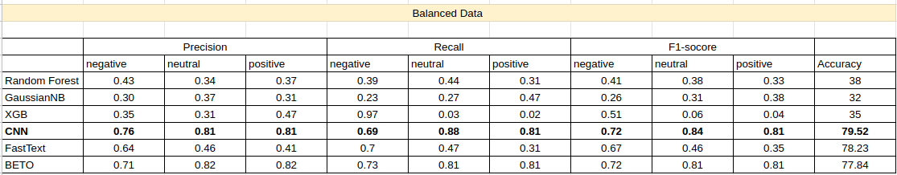
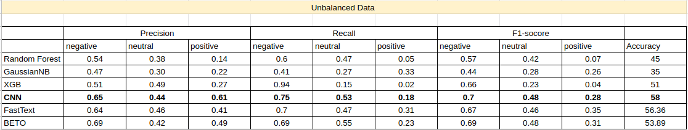

# Analysis-of-tweets
In this repository there are different models that analyze the opinion left by travelers on twitter. The data has been taken from a [competition in Kaggle](https://www.kaggle.com/c/spanish-arilines-tweets-sentiment-analysis/overview) carried out by a Spanish areoline. The data has been processed and various techniques have been tried for its processing.

## Machine Learning

- Bag of words([TF-idf](https://en.wikipedia.org/wiki/Tf%E2%80%93idf))
- Random Forest
- GuassianNB
- XGBoost

## Deep Learning

- Word Embedding([Glove](https://nlp.stanford.edu/projects/glove/))
- CNN with Kernel = 1: this is a [video](https://www.youtube.com/watch?v=vcp0XvDAX68) where explain this technique.
- [Fast-Text](https://arxiv.org/abs/1607.01759): a simple and efficient model for text classification.
- [BETO](https://github.com/dccuchile/beto): the model bert trained for spanish.
- [GRUs](https://towardsdatascience.com/understanding-gru-networks-2ef37df6c9be): Gated recurrent units.

## Results

All models have undergone a fine tuning process to get the best performance from them.

 
   </img>
   
Figure 1: Results of the experiment for a balanced Dataset

 
   </img>
   
Figure 2: Results of the experiment for a unbalanced Dataset

## Conclusion

As can be seen in the figures, the connectionist approach (deep learning) generates better results for both datasets, however, using balanced data, the models manage to reach 80% accuracy.CNN and Fast-text are fast and effective methods, however, despite being more powerful transofmers fall below the previous two methods. I suppose that the reason is because being a model designed for large volumes of data, with few data as is the case, only 7000 samples, these models give good results but it is not as impressive as in other applications.

## Technologies and Libraries

- [Python](https://www.python.org/) 🐍
- [Sklearn](https://scikit-learn.org/stable/) 🧮
- [PyTorch](https://pytorch.org/) ❤️
- [Hugging Face](https://github.com/huggingface) 🤖
